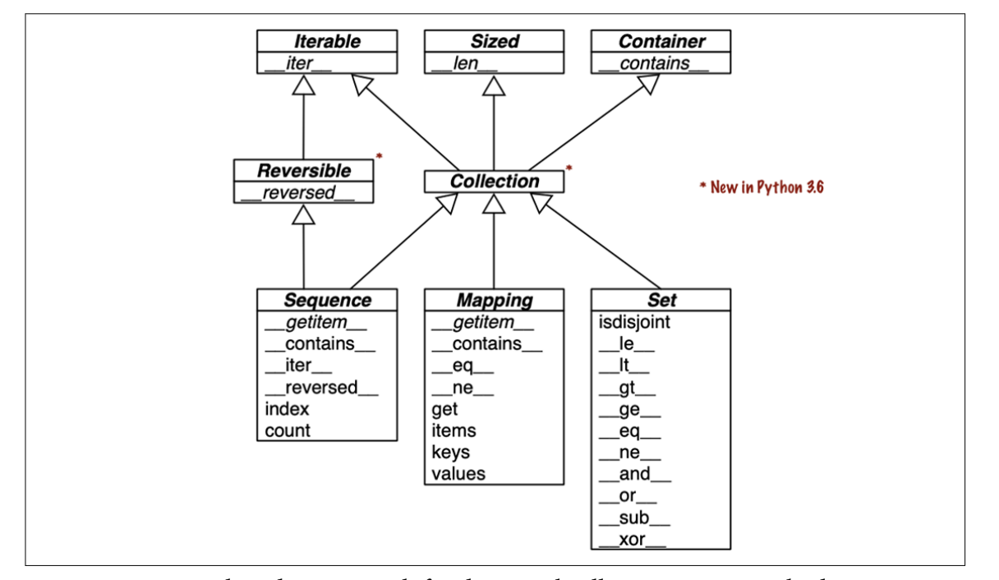
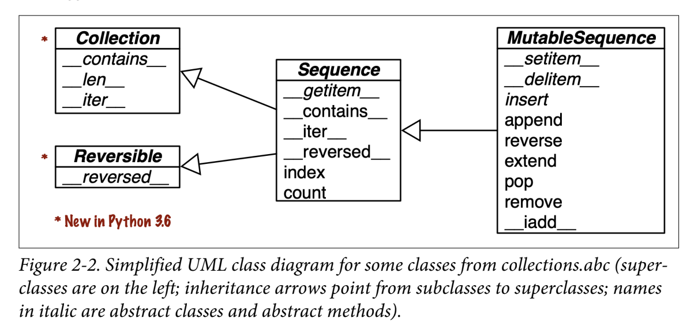

# Chapter 01 The Python Data Model

* We implement special methods when we want our objects to support and interact with fundamental language constructs such as:
  * Collections
  * Attribute access
  * Iteration (including asynchronous iteration using async for)
  * Operator overloading
  * Function and method invocation
  * String representation and formatting
  * Asynchronous programming using await
  * Object creation and destruction
  * Managed contexts using the with or async with statements

* dunder methods: under-under-method-under-under

## A Pythonic Card Deck

* `frenchdeck.py`

```python
#!/usr/bin/env python

import collections

Card = collections.namedtuple('Card', ['rank', 'suit'])


class FrenchDeck:
    ranks = [str(n) for n in range(2, 11)] + list('JQKA')
    suits = 'spades diamonds clubs hearts'.split()

    def __init__(self):
        self._cards = [Card(rank, suit) for suit in self.suits
                                        for rank in self.ranks]

    def __len__(self):
        return len(self._cards)

    def __getitem__(self, position):
        return self._cards[position]


if __name__ == '__main__':
    beer_card = Card('7', 'diamonds')
    print(beer_card)

    deck = FrenchDeck()
    print(len(deck))

    print(deck[0])
    print(deck[-1])

    from random import choice
    print(choice(deck))
    print(choice(deck))
    print(choice(deck))
    print(choice(deck))
```

* `namedtuple` can be used to build class with attributes and no methods.
* 2 advantages using special methods and python data model:
    * The user doesn't have to memorize the arbitrary method names for standard
      operations, `.size()` or `.length()`?
    * benefit from rich python SL, avoid reinventing wheels
* doctest example
    * When the output is too long, Luciano used the `# doctest: +ELLIPSIS` directive to make the doctest pass.

```python
>>> from frenchdeck import FrenchDeck, Card
>>> deck = FrenchDeck()
>>> for card in reversed(deck):  # doctest: +ELLIPSIS
...   print(card)
Card(rank='A', suit='hearts')
Card(rank='K', suit='hearts')
Card(rank='Q', suit='hearts')
...
```

* Then in the command line, just type

```shell
python -m doctest -v frenchdeck.doctest
```

* Because we defined `__getitem__`, the `FrenchDeck` is an iterable, and we can have the following.
  * There are 4 ways to make an object iterable, see [here](https://stackoverflow.com/questions/19151/how-to-build-a-basic-iterator).


```python
>>> Card('Q', 'hearts') in deck
True
>>> Card('7', 'beasts') in deck
False
```

* We can also sort it

```python
>>> suit_values = dict(spades=3, hearts=2, diamonds=1, clubs=0)
>>> def spades_high(card):
...     rank_value = FrenchDeck.ranks.index(card.rank)
...     return rank_value * len(suit_values) + suit_values[card.suit]

>>> spades_high(Card('2', 'clubs'))
0
>>> spades_high(Card('A', 'spades'))
51

>>> for card in sorted(deck, key=spades_high): # doctest: +ELLIPSIS
...     print(card)
```

* Although `FrenchDeck` implicitly inherits from the object class, most of its functionality is not inherited, but comes from leveraging the data model and composition. By implementing the special methods `__len__` and `__getitem__`, our `FrenchDeck` behaves like a standard Python sequence, allowing it to benefit from core language features (e.g., iteration and slicing) and from the standard library, as shown by the examples using `random.choice`, reversed, and `sorted`. Thanks to composition, the `__len__` and `__getitem__` implementations can delegate all the work to a list object, `self._cards`.
* How About Shuffling?
  * a `FrenchDeck` cannot be shuffled because it is immutable: In Chapter 13, we will fix that by adding a one-line `__setitem__` method.

## How special methods are used

* User should not call special methods, E.g., user do not call `my_object.__len__()`.
  * User call `len(my_object)`
  * Then python call `__len__` method you implemented.

* Built-in objects like `list, str, bytearray` has short cuts because they are implemented in C which has `PyVarObject`, which has an `ob_size` to hold size.
* Usually special method call is implicit, like `for i in x`, in this case, `iter()` is called, then `__iter__()` is called if implemented. Otherwise `x.__getitem__()` gets called.
* In general, a user should not call special methods directly. The only exception is to call `__init__` to invoke the initializer of the superclass in your own `__init__` implementation.
* If you need to invoke a special method, use `len, iter, str` etc.

### Emulating Numeric Types

* Here our goal is to further illustrate the use of special methods through another simple example.
* We will implement a class to represent two-dimensional vectors—that is, Euclidean vectors like those used in math and physics.
* See `vector.py` and `vector.doctest`.

```python
class Vector:
    def __init__(self, x=0, y=0):
        self.x = x
        self.y = y

    def __repr__(self):
        return 'Vector(%r, %r)' % (self.x, self.y)

    def __abs__(self):
        return hypot(self.x, self.y)

    def __add__(self, other):
        x = self.x + other.x
        y = self.y + other.y
        return Vector(x, y)

    def __mul__(self, scalar):
        return Vector(self.x * scalar, self.y * scalar)
```

* The string returned by `__repr__` should be unambiguous and if possible, match the source code necessary to recreate the object being represented.

### Boolean Value of a Custom Type

* By default, instances of user-defined classes are considered truthy, unless either `__bool__` or `__len__` is implemented.
  * `bool(x)` calls `x.__bool__()` and uses the result.
  * `__bool__` is not implemented, Python tries to invoke `x.__len__()`, and if that returns zero, `bool` returns `False`.
  * Otherwise `bool` returns `True`.
* So we add the following function and tests:

```python
class Vector:
    # ...
		def __bool__(self):
        return bool(self.x or self.y)
```

```
>>> bool(Vector(1, 1)) is True
True
>>> bool(Vector(0, 0)) is False
True
```

### Collection API

* All the classes in the diagram are ABCs—abstract base classes.



* Each of the top ABCs has a single special method. The `Collection` ABC (new in Python 3.6) unifies the three essential interfaces that every collection should implement:
  * `Iterable` to support for, unpacking, and other forms of iteration
  * `Sized` to support the len built-in function
  * `Container` to support the in operator
* Three very important specializations of Collection are:
  * `Sequence`, formalizing the interface of built-ins like `list` and `str`
  * `Mapping`, implemented by `dict`, `collections.defaultdict`, etc.
  * `Set`, the interface of the `set` and `frozenset` built-in types
* All the special methods in the `Set` ABC implement infix operators.
  * `a & b` computes the intersection of sets a and b, and is implemented in the `__and__` special method.

## Overview of Special Methods

* Use 3 tables to list almost all special methods.

## Why len Is Not a Method

* “practicality beats purity.”: The `len(x)` on built-in type needs to run very fast, since it just reads a field.
* But for custom objects, `len` calls `__len__`, This is a fair compromise between the need for efficient built-in objects and the consistency of the language.
* You can think of `abs` and `len` as unary operators.

## Chapter Summary

* By implementing special methods, your objects can behave like the built-in types
* A basic requirement for a Python object is to provide usable string representations of itself, one used for debugging and logging.
* Emulating sequences, as shown with the `FrenchDeck` example, is one of the most common uses of the special methods.
* Thanks to operator overloading, Python offers a rich selection of numeric types, from the built-ins to `decimal.Decimal` and `fractions.Fraction`, all supporting infix arithmetic operators.

# Chapter 02 An array of sequences

* This chapter will cover:
  * List comprehensions and the basics of generator expressions
  * Using tuples as records versus using tuples as immutable lists
  * Sequence unpacking and sequence patterns
  * Reading from slices and writing to slices
  * Specialized sequence types, like arrays and queues

## Overview of built-in sequence

* Container sequences: e.g.`list`, `tuple`, `collections.deque` holds different types.
    * holds references to the objects it contains.
* Flat sequences: e.g. `str`, `bytes`, `bytearray`, `memoryview`, `array.array` holds one type.
    * stores the value of its contents in its own memory space.
    * More compact, but are limited to holding primitive machine values like `bytes`, `integers`, and `floats`.
* Every Python object in memory has a header with metadata.
* The simplest one, `float`, has a value field and two metadata fields:
    * `ob_refcnt`: the object’s reference count, 8-byte in 64-bit python build.
    * `ob_type`: a pointer to the object’s type, 8-byte in 64-bit python build.
    * `ob_fval`: a C double holding the value of the `float`, 8-byte in 64-bit python build.
* So, an array of `floats` is much more compact than a tuple of `floats`.
* From mutable point of view:
    * mutable: `list`, `collections.deque`, `bytearray`, `memoryview`, `array.array`
    * immutable: `tuple`, `str`, `bytes`
* UML diagram:
    * `class Sequence(Container, Iterable, Sized)`
    * `class MutableSequence(Sequence)`



```python
"""

    >>> from collections import abc
    >>> issubclass(tuple, abc.Sequence)
    True
    >>> issubclass(list, abc.MutableSequence)
    True

"""
```

* Keep in mind these common traits: mutable versus immutable; container versus flat. They are helpful to extrapolate what you know about one sequence type to others.

## List Comprehension (list comps) and generator expressions (genexps)

* A quick way to build a sequence is using a list comprehension (if the target is a list) or a generator expression (for other kinds of sequences).

  * faster and more readable.
  * If you are not doing something with the produced list, you should not use that syntax.
  * Also, try to keep it short. If the list comprehension spans more than two lines, it is probably best to break it apart or rewrite it as a plain old for loop.

  ```python
  """
  # listcomp.py
  >>> symbols = '$¢£¥€¤'
  >>> codes = [ord(code) for code in symbols]
  >>> codes
  [36, 162, 163, 165, 8364, 164]
  """
  ```

* In Python code, line breaks are ignored inside pairs of `[]`, {}, or `()`. So you can build multiline lists, listcomps, tuples, dictionaries, etc., without using the `\` line continuation escape, which doesn’t work if you accidentally type a space after it.

* Also, when those delimiter pairs are used to define a literal with a comma-separated series of items, a trailing comma will be ignored. So, for example, when coding a multiline list literal, it is thoughtful to put a comma after the last item, making it a little easier for the next coder to add one more item to that list, and reducing noise when reading diffs.

### Local Scope Within Comprehensions and Generator Expressions

* Variables assigned with the “Walrus operator” := remain accessible after those comprehensions or expressions return—unlike local variables in a function. PEP 572—Assignment Expressions defines the scope of the target of := as the enclosing function, unless there is a global or nonlocal declaration for that target.

```python
"""
>>> x = 'ABC'
>>> codes = [ord(x) for x in x]
>>> x # x was not clobbered: it’s still bound to 'ABC'.
'ABC'
>>> codes
[65, 66, 67]
>>> codes = [last := ord(c) for c in x]
>>> last # last remains.
67
>>> c # doctest: +IGNORE_EXCEPTION_DETAIL
Traceback (most recent call last):
NameError: name 'c' is not defined

In the above example c is gone; it existed only inside the listcomp.

"""
```

## Listcomps Versus map and filter

* `map` and `filter` lost some readablity. Luciano used to think listcomp is much slower than `map` and `filter`, but this is not the case. See the results below.
  * To see the difference between `number` and `repeat`, see [here](https://stackoverflow.com/questions/56763416/what-is-diffrence-between-number-and-repeat-in-python-timeit).


```python
# listcomps_speed.py
import timeit

TIMES = 10000
SETUP = """
symbols = '$¢£¥€¤'
def non_ascii(c):
    return c > 127
"""


def clock(label, cmd):
    res = timeit.repeat(cmd, setup=SETUP, number=TIMES, repeat=6)
    print(label, *(f'{x:.3f}' for x in res))


clock('listcomp        :', '[ord(s) for s in symbols if ord(s) > 127]')
clock('listcomp + func :', '[ord(s) for s in symbols if non_ascii(ord(s))]')
clock('filter + lambda :', 'list(filter(lambda c: c > 127, map(ord, symbols)))')
clock('filter + func   :', 'list(filter(non_ascii, map(ord, symbols)))')

listcomp        : 0.007 0.007 0.006 0.007 0.007 0.007
listcomp + func : 0.011 0.010 0.011 0.010 0.011 0.011
filter + lambda : 0.009 0.009 0.009 0.009 0.009 0.009
filter + func   : 0.009 0.008 0.008 0.008 0.009 0.011
```

## Cartesian Products

* Listcomps can build lists from the Cartesian product of two or more iterables. The items that make up the Cartesian product are tuples made from items from every input iterable.
* code: `cartesian.py`

```python
>>> colors = ['black', 'white']
>>> sizes = ['S', 'M', 'L']

>>> tshirts = [(color, size) for color in colors
...                          for size in sizes ]
>>> tshirts   # doctest: +NORMALIZE_WHITESPACE
[('black', 'S'), ('black', 'M'), ('black', 'L'), ('white', 'S'),
('white', 'M'), ('white', 'L')]

>>> tshirts = [(color, size) for size in sizes
...                          for color in colors ]
>>> tshirts  # doctest: +NORMALIZE_WHITESPACE
[('black', 'S'), ('white', 'S'), ('black', 'M'), ('white', 'M'),
('black', 'L'), ('white', 'L')]
```

* listcomp builds list, genexp builds other sequences.

## Generator Expressions

* `genexp` saves memory because it yields items one by one using the iterator protocol instead of building a whole list.
  * ① If the generator expression is the single argument in a function call, there is no need to duplicate the enclosing parentheses.
  * ② The `array` constructor takes two arguments, so the parentheses around the generator expression are mandatory.


```python
>>> symbols = '$¢£¥€¤'
>>> tuple(ord(code) for code in symbols)  # ➊
(36, 162, 163, 165, 8364, 164)

>>> import array
>>> array.array('I', (ord(code) for code in symbols))  # ➋
array('I', [36, 162, 163, 165, 8364, 164])
```

* The next example:
  * Here the six-item list of T- shirts is never built in memory: the generator expression feeds the `for` loop producing one item at a time.

```python
>>> for tshirt in ('%s %s' % (color, size) for color in colors for size in sizes):
...     print(tshirt)
black S
black M
black L
white S
white M
white L
```

## Tuples are not just immutable lists

* Tuples do double duty:
  * they can be used as immutable lists
  * also as records with no field names.

### Tuples as Records

* Tuples hold records: each item in the tuple holds the data for one field, and the position of the item gives its meaning.
    1. The `%` formatting operator understands tuples and treats each item as a separate field.
    2. The `for` loop knows how to retrieve the items of a tuple separately—this is called “unpacking.” Here we are not interested in the second item, so we assign it to `_`, a dummy variable.

```python
>>> lax_coordinates = (33.9425, -118.408056)
>>> city, year, pop, chg, area = ('Tokyo', 2003, 32450, 0.66, 8014)
>>> traveler_ids = [('USA', '31195855'), ('BRA', 'CE342567'),
... ('ESP', 'XDA205856')]

>>> for passport in sorted(traveler_ids):
...    print('%s/%s' % passport)  // 1
...
BRA/CE342567
ESP/XDA205856
USA/31195855

>>> for country, _ in traveler_ids:  // 2
...     print(country)
...
USA
BRA
ESP
```

* We have two examples of tuple unpacking here:
  * we assigned `('Tokyo', 2003, 32_450, 0.66, 8014)` to `city, year, pop, chg, area` in a single statement.
  * the `%` operator assigned each item in the passport tuple to the corresponding slot in the format string in the `print` argument.

### Tuples as Immutable Lists

* *Clarity*: When you see a tuple in code, you know its length will never change.
* *Performance*: A tuple uses less memory than a list of the same length, and it allows Python to do some optimizations.
* References in a `tuple` cannot be deleted or replaced. But if one of those references points to a mutable object, and that object is changed, then the value of the `tuple` changes.

```python
>>> a = (10, 'alpha', [1, 2])
>>> b = (10, 'alpha', [1, 2])
>>> a == b
True
>>> b[-1].append(99)
>>> a == b
False
>>> b
(10, 'alpha', [1, 2, 99])
```

* An object is only hashable if its value cannot ever change. An unhashable tuple cannot be inserted as a `dict` key, or a `set` element.
* If you want to determine explicitly if a tuple (or any object) has a fixed value, you can use the `hash` built-in to create a fixed function like this:

```python
def fixed(o):
    """
    >>> tf = (10, 'alpha', (1, 2))
    >>> fixed(tf)
    True
    >>> tf = (10, 'alpha', [1, 2])
    >>> fixed(tf)
    False
    """
    try:
        hash(o)
    except TypeError:
        return False
    return True
```

* Raymond Hettinger on the efficiency of `tuple` over `list`
  * To evaluate a tuple literal, the Python compiler generates bytecode for a tuple constant in one operation; but for a list literal, the generated bytecode pushes each element as a separate constant to the data stack, and then builds the list.
  * Given a tuple `t`, `tuple(t)` simply returns a reference to the same `t`. There’s no need to copy. In contrast, given a list `l`, the `list(l)` constructor must create a new copy of `l`.
  * Because of its fixed length, a `tuple` instance is allocated the exact memory space it needs. Instances of `list`, on the other hand, are allocated with room to spare, to amortize the cost of future appends.
  * The references to the items in a tuple are stored in an array in the tuple struct, while a list holds a pointer to an array of references stored elsewhere.

### Comparing Tuple and List Methods

* `tuple` supports all list methods that do not involve adding or removing items, with one exception—`tuple` lacks the `__reversed__` method.
* However, that is just for optimization; `reversed(my_tuple)` works without it.

## Unpacking Sequences and Iterables

* Unpacking is important because it avoids unnecessary and error-prone use of indexes to extract elements from sequences.
* Also, unpacking works with any iterable object as the data source—including iterators, which don’t support index notation (`[]`).
  * The only requirement is that the iterable yields exactly one item per variable in the receiving end, unless you use a star (`*`) to capture excess items,

* tuple unpacking (`tupleunpacking.py`):
    * The most visible form of unpacking is parallel assignment
    
    ```python
    >>> lax_coordinates = (33.9425, -118.408056)
    >>> latitude, longitude = lax_coordinates
    >>> latitude
    33.9425
    >>> longitude
    -118.408056
    ```
    
    * Can do swapping value elegently, i.e. `a, b = b, a`
    * Prefix an argument with a star when calling a function.
    
    ```python
    >>> divmod(20, 8)
    (2, 4)
    >>> t = (20, 8)
    >>> divmod(*t)
    (2, 4)
    >>> quotient, remainder = divmod(*t)
    >>> quotient
    2
    >>> remainder
    4
    ```
    
    * When don't care a variable, use `_`
    
    ```python
    >>> import os
    >>> _, filename = os.path.split('/home/luciano/.ssh/id_rsa.pub')
    >>> filename
    'id_rsa.pub'
    ```

### Using `*` to Grab Excess Items

* Defining function parameters with *args to grab arbitrary excess arguments is a classic Python feature.
* In Python 3, this idea was extended to apply to parallel assignment as well:

```python
>>> a, b, *rest = range(5)
>>> a, b, rest
(0, 1, [2, 3, 4])
>>> a, b, *rest = range(3)
>>> a, b, rest
(0, 1, [2])
>>> a, b, *rest = range(2)
>>> a, b, rest
(0, 1, [])
```

* In the context of parallel assignment, the `*` prefix can be applied to exactly one variable, but it can appear in any position:

```python
>>> a, *body, c, b = range(5)
>>> a, body, c, b
(0, [1, 2], 3, 4)
>>> *head, b, c, d = range(5)
>>> head, b, c, d
([0, 1], 2, 3, 4)
```

### Unpacking with `*` in Function Calls and Sequence Literals

* In function calls, we can use `*` multiple times:

```python
>>> def func(a, b, c, d, *rest):
...     return a, b, c, d, rest
>>> func(*[1, 2], 3, *range(4, 7))
(1, 2, 3, 4, (5, 6))
```

* The `*` can also be used when defining `list`, `tuple`, or `set` literals, as shown in these examples from “What’s New In Python 3.5”:

```python
>>> *range(4), 4
(0, 1, 2, 3, 4)
>>> [*range(4), 4]
[0, 1, 2, 3, 4]
>>> {*range(4), 4, *(5, 6, 7)}
{0, 1, 2, 3, 4, 5, 6, 7}
```

### Nested Unpacking

* The target of an unpacking can use nesting, e.g., `(a, b, (c, d))`.
  * Each tuple holds a record with four fields, the last of which is a coordinate pair.
  * By assigning the last field to a nested tuple, we unpack the coordinates.
  * The `lon <= 0`: test selects only cities in the Western hemisphere.

```python
>>> metro_areas = [
...     ('Tokyo','JP',36.933,(35.689722,139.691667)), # 1
...     ('Delhi NCR', 'IN', 21.935, (28.613889, 77.208889)),
...     ('Mexico City', 'MX', 20.142, (19.433333, -99.133333)),
...     ('New York-Newark', 'US', 20.104, (40.808611, -74.020386)),
...     ('São Paulo', 'BR', 19.649, (-23.547778, -46.635833)),
... ]
>>> def main():
...     print(f'{"":15} | {"latitude":>9} | {"longitude":>9}')
...     for name, _, _, (lat, lon) in metro_areas: # 2
...         if lon <= 0: # 3
...             print(f'{name:15} | {lat:9.4f} | {lon:9.4f}')
>>> main()
                |  latitude | longitude
Mexico City     |   19.4333 |  -99.1333
New York-Newark |   40.8086 |  -74.0204
São Paulo       |  -23.5478 |  -46.6358
```

* The target of an unpacking assignment can also be a list, but good use cases are rare. Here is the only one I know: if you have a database query that returns a single record (e.g., the SQL code has a `LIMIT 1` clause), then you can unpack and at the same time make sure there’s only one result with this code:

```python
[record] = query_returning_single_row()
```

* If the record has only one field, you can get it directly, like this:

```python
[[field]] = query_returning_single_row_with_single_field()
```

* Both of these could be written with tuples, but don’t forget the syntax quirk that single-item tuples must be written with a trailing comma. So the first target would be `(record,)` and the second `((field,),)`. In both cases you get a silent bug if you forget a comma.

## Pattern Matching with Sequences

* This is a new feature in 3.10
  * 1 The expression after the `match` keyword is the *subject*. The subject is the data that Python will try to match to the patterns in each case clause.
  * 2 This pattern matches any subject that is a sequence with three items. The first item must be the string `'BEEPER'`. The second and third item can be anything, and they will be bound to the variables frequency and times, in that order.
  * 3 This matches any subject with two items, the first being `'NECK'`.
  * 4 This will match a subject with three items starting with `'LED'`. If the number of items does not match, Python proceeds to the next case.
  * 5 Another sequence pattern starting with `'LED'`, now with five items—including the `'LED'` constant.
  * This is the `default` case. It will match any subject that did not match a previous pattern. The `_` variable is special, as we’ll soon see.

```python
>>> def handle_command(message):
...     match message:  # 1
...         case ['BEEPER', frequency, times]:  # 2
...             self.beep(times, frequency)
...         case ['NECK', angle]:  # 3
...             self.rotate_neck(angle)
...         case ['LED', ident, intensity]:  # 4
...             self.leds[ident].set_brightness(ident, intensity)
...         case ['LED', ident, red, green, blue]:  # 5
...             self.leds[ident].set_color(ident, red, green, blue)
...         case _:  # 6
...             raise InvalidCommand(message)
```

* One key improvement of `match` over `switch` is destructuring—a more advanced form of unpacking.
    * 1 The subject of this `match` is `record`— i.e., each of the tuples in `metro_areas`.
    * A `case` clause has two parts: a pattern and an optional guard with the `if` keyword.


```python
>>> metro_areas = [
...     ('Tokyo', 'JP', 36.933, (35.689722, 139.691667)),
...     ('Delhi NCR', 'IN', 21.935, (28.613889, 77.208889)),
...     ('Mexico City', 'MX', 20.142, (19.433333, -99.133333)),
...     ('New York-Newark', 'US', 20.104, (40.808611, -74.020386)),
...     ('São Paulo', 'BR', 19.649, (-23.547778, -46.635833)),
... ]
...
>>> def main():
...     print(f'{"":15} | {"latitude":>9} | {"longitude":>9}')
...     for record in metro_areas:  # 1
...         match record:
...             case [name, _, _, (lat, lon)] if lon <= 0:  # 2
...                 print(f'{name:15} | {lat:9.4f} | {lon:9.4f}')
```

* A sequence pattern can match instances of most actual or virtual subclasses of `collections.abc.Sequence`, with the exception of `str`, `bytes`, and `bytearray`.

  * If you want to treat an object of those types as a sequence subject, convert it in the `match` clause.

  ```python
  match tuple(phone):
      case ['1', *rest]: # North America and Caribbean
      		...
      case ['2', *rest]: # Africa and some territories
      		...
      case ['3' | '4', *rest]:
  ```

* In the standard library, these types are compatible with sequence patterns:

  * Unlike unpacking, patterns don’t destructure iterables that are not sequences (such as iterators).

```
list  memoryview array.array
tuple range      collections.deque
```

* The `_` symbol:

  * matches any single item in that position
  * never bound to the value of the matched item
  * `_` is the only variable that can appear more than once in a pattern.

  ```python
  case [name, _, _, (lat, lon) as coord]:
  # subject is ['Shanghai', 'CN', 24.9, (31.1, 121.3)]
  name  'Shanghai'
  lat   31.1
  lon   121.3
  coord (31.1, 121.3)
  ```

* We can make patterns more specific by adding type information.

* 1. the first item must be an instance of `str`
  2. both items in the 2-tuple must be instances of `float`

```python
case [str(name), _, _, (float(lat), float(lon))]:
```

* On the other hand, if we want to match any subject sequence starting with a `str`, and ending with a nested sequence of two `floats`, we can write:
  * The `*_` matches any number of items, without binding them to a variable.

```python
case [str(name), *_, (float(lat), float(lon))]:
```

* The optional guard clause starting with `if` is evaluated only if the pattern matches, and can reference variables bound in the pattern:

```python
match record:
		case [name, _, _, (lat, lon)] if lon <= 0:
			print(f'{name:15} | {lat:9.4f} | {lon:9.4f}')
```

### Pattern Matching Sequences in an Interpreter

* Peter Norvig of Stanford University wrote [lis.py](https://github.com/fluentpython/example-code-2e/tree/master/02-array-seq/lispy/py3.10): an interpreter for a subset of the Scheme dialect of the Lisp programming language in 132 lines of beautiful and readable Python code.
* This is the original Norvig's code with `if-else`

```python
def evaluate(exp: Expression, env: Environment) -> Any:
    "Evaluate an expression in an environment."
    if isinstance(exp, Symbol): # variable reference
    		return env[exp]
    # ... lines omitted
    elif exp[0] == 'quote': # (quote exp)
        (_, x) = exp
        return x
    elif exp[0] == 'if': # (if test conseq alt)
        (_, test, consequence, alternative) = exp
        if evaluate(test, env):
        		return evaluate(consequence, env)
        else:
        		return evaluate(alternative, env)
    elif exp[0] == 'lambda': # (lambda (parm...) body...)
        (_, parms, *body) = exp
        return Procedure(parms, body, env)
    elif exp[0] == 'define':
        (_, name, value_exp) = exp
        env[name] = evaluate(value_exp, env)
```

* We can use `match/case` in Python ≥ 3.10
    1. Match if subject is a two-item sequence starting with `'quote'`.
    2. Match if subject is a four-item sequence starting with `'if'`.
    3. Match if subject is a sequence of three or more items starting with `'lambda'`. The
       guard ensures that `body` is not empty.
    4. Match if subject is a three-item sequence starting with `'define'`, followed by an
       instance of `Symbol`.
    5. It is good practice to have a catch-all `case`. In this example, if exp doesn’t match any of the patterns, the expression is malformed, and I raise `SyntaxError`.

```python
def evaluate(exp: Expression, env: Environment) -> Any:
    "Evaluate an expression in an environment."
    match exp:
    # ... lines omitted
        case ['quote', x]:  # 1
        		return x
        case ['if', test, consequence, alternative]:  # 2
            if evaluate(test, env):
            		return evaluate(consequence, env)  
            else:
            		return evaluate(alternative, env)
        case ['lambda', [*parms], *body] if body:  # 3
        		return Procedure(parms, body, env)
        case ['define', Symbol() as name, value_exp]:  # 4
        		env[name] = evaluate(value_exp, env)
        # ... more lines omitted
        case _:  # 5
						raise SyntaxError(lispstr(exp))
```

* To figure out what doest `#3` work, I did one more experiment
  * As we can see, the second item after `'lambda'` needs to be a `list` or a `tuple`. Then the `parms` will be a list. 
  * Note the second item can be an empty `list`. See the section "Alternative patterns for lambda" below.

```python
>>> def lisp_evaluate_trial(exp):
...     match exp:
...         case ['lambda', [*parms], *body] if body:
...              print(parms, body)
...         case _:
...              print('Unknow case!')
>>> exp = ['lambda', [1, 2, 3], 'haha', 'lala']
>>> lisp_evaluate_trial(exp)
[1, 2, 3] ['haha', 'lala']
>>> exp = ['lambda', 1, 'haha', 'lala']
>>> lisp_evaluate_trial(exp)
Unknow case!
>>> exp = ['lambda', (1,), 'haha', 'lala']
>>> lisp_evaluate_trial(exp)
[1] ['haha', 'lala']
>>> exp = ['lambda', [], 'haha', 'lala']
>>> lisp_evaluate_trial(exp)
[] ['haha', 'lala']
```

* Without a catch-all, the whole match statement does nothing when a subject does not match any case—and this can be a silent failure.
* With pattern matching, we can add more checks and still keep it readable.
  * For example, in the `'define'` pattern, the original code does not ensure that name is an instance of `Symbol`—that would require an `if` block, an `isinstance` call, and more code.

#### Alternative patterns for lambda

* This is syntax of `lambda` in Scheme, `(lambda (parms...) body1 body2...)` .

* An simple pattern could be `case ['lambda', parms, *body] if body:`, then we could match the following invalid syntax:

```python
>>> def simple_lambda_trial(exp):
...     match exp:
...         case ['lambda', parms, *body] if body:
...              print(parms, body)
...         case _:
...              print('Unknow case!')
>>> exp = ['lambda', 'x', ['*', 'x', 2]]
>>> simple_lambda_trial(exp)
x [['*', 'x', 2]]
```

* So we have to use `case ['lambda', [*parms], *body] if body`.
  * The nested list after the `lambda` keyword in Scheme holds the names of the formal parameters for the function, and it must be a list even if it has only one element. It may also be an empty list.
  * In a sequence pattern, `*` can appear only once per sequence. Here we have two sequences: the outer and the inner.

* assignment can have nested tuples.
* `namedtuple`
    * Accept 2 arguments, 1st is the class name, second can be a list of string or a string with single
      space delimit
    * The instantiation must take positional arguments not iterables.
    * The elements can be accessed by name or position
    * Most useful attribute: '\_fields'
    * Most useful methods: `_make(iterable)`, `_asdict()`: return `OrderedDict`

# Chapter -1 Other Notes

* [Github link](https://github.com/fluentpython/example-code-2e)

## How to run doctest

* Example 1:

```python
"""
vector2d.py: a simplistic class demonstrating some special methods
It is simplistic for didactic reasons. It lacks proper error handling,
especially in the ``__add__`` and ``__mul__`` methods.
This example is greatly expanded later in the book.

Addition::

    >>> v1 = Vector(2, 4)
    >>> v2 = Vector(2, 1)
    >>> v1 + v2
    Vector(4, 5)

"""

class Vector:
  	# ...

if __name__ == "__main__":
    import doctest
    doctest.testmod()
```

```shell
 python vector.py -v
```

* Example 2

```python
>>> from vector import Vector
>>> v1 = Vector(2, 4)
>>> v2 = Vector(2, 1)
>>> v1 + v2
Vector(4, 5)
>>> v = Vector(3, 4)
>>> abs(v)
5.0
>>> v * 3
Vector(9, 12)
>>> abs(v * 3)
15.0
```

```shell
python -m doctest -v vector.doctest
```

* How to add `...` if the output is too long:

  * Reference from [stackoverflow](https://stackoverflow.com/questions/17092215/how-enable-ellipsis-when-calling-python-doctest).

  ```python
  def foo():
      """
      >>> foo() # doctest: +ELLIPSIS
      hello ...
      """
      print("hello world")
  ```

  ```
  python -m doctest foo.py 
  ```

  * If we want to use `...` for all the tests

  ```python
  def foo():
      """
      >>> foo()
      hello ...
      """
      print("hello world")
  
  if __name__ == "__main__":
      import doctest
      doctest.testmod(verbose=True, optionflags=doctest.ELLIPSIS)
  ```

  ```shell
  python foo.py -v
  ```

* How to catch exception?

  * [Stackover anwser](https://stackoverflow.com/questions/12592/can-you-check-that-an-exception-is-thrown-with-doctest-in-python).

  ```python
  >>> c # doctest: +IGNORE_EXCEPTION_DETAIL
  Traceback (most recent call last):
  NameError: name 'c' is not defined
  ```

* How to do multiline in output when it's too long: adding `+NORMALIZE_WHITESPACE`

```python
>>> tshirts = [(color, size) for color in colors
...                          for size in sizes ]
>>> tshirts   # doctest: +NORMALIZE_WHITESPACE
[('black', 'S'), ('black', 'M'), ('black', 'L'), ('white', 'S'),
('white', 'M'), ('white', 'L')]
```

# Further Reading

## Chapter 1

* [Data model chapter](https://docs.python.org/3/reference/datamodel.html).
* [Python in a nutshell](https://www.oreilly.com/library/view/python-in-a/9781491913833/).
* Python Essential Reference
* Python Cook‐ book, 3rd ed.
* The Art of the Metaobject Protocol (Author's favorite)

# Cool Staff I Learned

## Chapter 1

* The use of `doctest`

## Chapter 2

* `timeit` module
* `hash` built-in
