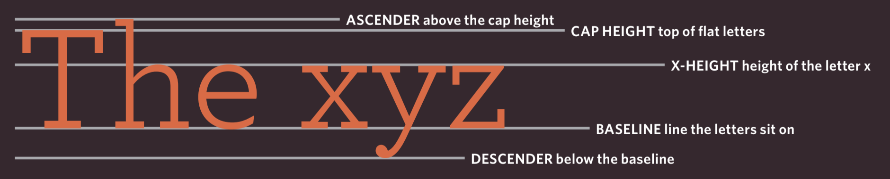

# Ch01 Structures

* Elements are usually
made up of two tags: an opening tag and a closing tag. (The closing tag
has an extra forward slash in it.) Each HTML element tells the browser
something about the information that sits between its opening and
closing tags.

* Tags act like containers. They tell you
something about the information that lies
between their opening and closing tags.

* The terms "tag" and "element" are often used interchangeably.

* Strictly speaking, however, an element comprises the opening

* tag and the closing tag and any content that lies between them.

* Attributes appear on the opening tag of the element and are
made up of two parts: a name and a value,
separated by an equals sign.
    * Attributes name should be in lower case
    * Attributes value should be in double quotes.

```html
<p lang="en-us">Paragraph in English</p>
```

# Ch02 Text

Pg 47

* `<h1>` through `<h6>`
* `<p>`
* `<i>`, `<b>`
* `<sub>, <sup>`
* whitespace will be collapsing.
* line break tag: `<br />`
* horizontal breaker: `<hr />`

## Semantic Markup

* `<strong>, <em>`
* `<blockquote> <q>`
* `<abbr>`
* `<cite> <dfn>`
* `<ins> <del> <s>`

# Ch03 List

* Ordered List: use bullets
    * `<ol>, <li>`
* Unodered List: use numbers
    * `<ul>, <li>`
* Definition list: define terminology
    * `<dl>`
    * `<dt>`: the term to be defined
    * `<dd>`: the real definition
* List can be nested

# Ch04 Links

pg 81

* Created with `<a></a>`

```html
<a href="http://www.imdb.com">IMDB</a>
```

* Linking to Other Sites
    * `<a>`
* Linking to other pages on the same site, no need to specify
  absolute URL.
    * `<a href="ch02.html">Chapter 02</a>`
* Relative Link Type
    * Same Folder: `<a href="reviews.html">Reviews</a>`
    * Child Folder: `<a href="music/listings.html">Listings</a>`
    * Grandchildren folder: `<a href="movies/dvd/reviews.html">Reviews</a>`
    * GrandParent Folder: `<a href="../../index.html">Home</a>`
* Email links
    * `<a href="mailto:jon@example.org">Email Jon</a>`
* Open in new window: Use `target="_blank"`
* Link to a specific part in the same page.
    * `<h1 id="top">Film Making Terms</h1>`
    * `<a href="#top">Top</a>`

# Ch05 Images

Pg 101

* `` element
    * `src`: the location of the image
    * `alt`: used by screen reader software
    * `title`: mouse hover on to the image
    * `height`/`width`
    * `align="left"`, `align="right"`
    * `align="top"`, `align="middle"`, `align="bottom"`
* 3 rules:
    * Save image in the right format
    * Save image in the right size
    * Save image use correct resolution
* `<figure>` and `<figurecaption>`

# Ch 06 Tables

Pg 133

* `<table>`
    * `<tr>`: table row
    * `<td>`: table data
    * `<th>`: table heading, the `scope` attribute indicates
      `row` or `col`
* Spanning columns/rows
    * Use attr `colspan="2"`
    * Use attr `rowspan="2"`
* Long tables: `thead`, `tbody`, `tfoot`
    * Use css can change its appearance
* Width and spacing, old code, **replaced by CSS**
    * `width`, can add in the `<table>` or the first row, in pixels.
    * `cellpadding` attribute to add space inside each cell of
      the table, in pixels.
    * `cellspacing`: to create space between each cell of the table,
      in pixels.
* Border and background:
    * `border=2`, can be used in `table` and `td`, in pixels.
    * `bgcolor=#cccccc`, can be used for entire table or cell,
      usually hex code.

# Ch 07 Forms

Pg 151

* Different types of form
    * Adding Text:
        * Text input
        * Password
        * Text area
    * Make Choices:
        *  Radio button
        * checkbox
        * drop-down box
    * Submit forms:
        * submit buttons
        * image button
    * Uploading files
        * File upload
* `<form>`
    * attribute: `action`, is the URL for the page on the
      server that will receive the
      information
    * attribute: `method`, can be `get` or `post`
        * `get` good for short forms and retrieving data
        * `post` upload file/very long
    * attribute: `id`

* Text input:
    * `size`: should not be used for new form.
      no. of characters to display.
    * `maxlength`: limit the characters
    * `name`: The value of this attribute identifies the form
      control and is sent along with the information
      they enter to the server.

```HTML
<form action="http://www.example.com/login.php">
  <p>Username:
    <input type="text" name="username" size="15" maxlength="30">
  </p>
</form>
```

* Password input:

```HTML
<p>Password:
  <input type="password" name="password" size="15" maxlength="30" />
</p>
```

* `<textarea>`: it's not an empty element.

```HTML
<textarea name="comments" cols="20" rows="4">Enter your comments...
</textarea>
```

* Radio button
    * `name`: the value of the name attribute should be the
      same for all of the radio buttons
      used to answer that question.
    * `value`: will send to the server.
    * `checked="checked"`: the default value when the page loads.

```html
<p>Please select your favorite genre:</p>
<br />
<input type="radio" name="genre" value="Rock" checked="checked"/> Rock
<input type="radio" name="genre" value="Pop" /> Pop
<input type="radio" name="genre" value="Jazz" /> Jazz
```

* Check box: `<checkbox>`
    * `name`: the value of the name attribute should be the
      same for all of the radio buttons
      used to answer that question.
    * `value`: will send to the server.
    * `checked="checked"`: the default value when the page loads.

```html
<input type="checkbox" name="service" value="itunes" checked="checked" /> Itunes
<input type="checkbox" name="service" value="lastfm" /> Last.fm
<input type="checkbox" name="service" value="spotify" /> Spotify
```

* Drop down list: `<select>`
    * `selected="selected"`: the default value when the page loads.

```html
<select name="devices">
  <option value="ipod">iPod</option>
  <option value="radio" selected="selected">Radio</option>
  <option value="computer">Computer</option>
</select>
```

* Comparison between radio button and drop down list:
1. If users need to see all options at a glance, radio buttons are
better suited.
2. If there is a very long list of options (such as a list of
countries), drop down list boxes work better.

* Multiple select box: `<select>`
    * `size`: how many options are shown
    * `multiple`: this determines the multiple select.

```HTML
<select name="instruments" size="3" multiple="multiple">
  <option value="guitar">Guitar</option>
  <option value="drum">Drum</option>
  <option value="keyboard">Keyboard</option>
  <option value="bass">Bass</option>
</select>
```

* File Input Box `<input>`
    * `typt=file`

```html
<p>upload your song in MP3 format:</p>
<input type="file" name="user-song" > <br />
<input type="submit" value="Upload">
```

* Submit button `<input>`
    * `type="submit"`
    * `value`: control the text that appears on a button.

```HTML
<p>Subscribe to our email list:</p>
<input type="email" name="email" value="">
<input type="submit" name="" value="Subscribe">
```

* Image button `<input>`
    * `type="image"`

```HTML
<input type="email" name="email" value="">
<input type="image" src="./images/GEB.webp" value="Subscribe"
      height="20" width="100" align="bottom"
/>
```

* Button

```HTML
<button> Add</button>
<input type="hidden" name="bookmark"
value="lyrics" />
```

* Labelling Form Controls `<label>`.
    * Wrap around both the text description and the form input
    * Be kept separate from the form control and use the for
      attribute to indicate which form control it is a label for
    * `for`: When a `<label>` element is used with a checkbox
      or radio button, users can click on either the form control or the
      label to select.  

```HTML
<label>Age: <input type="text" name="age"></label>
<br />
Gender:
<input id="female" type="radio" name="gender" value="f">
<label for="female">Female</label>
<input id="male" type="radio" name="gender" value="m">
<label for="male">Male</label>
```

* Above or to the left:
    * Text inputs
    * Text areas
    * Select boxes
    * File uploads
* To the right:
    * Check boxes
    * Radio button

* Grouping form elements: `<fieldset>`, `<legend>`

```html
<h1>fieldset</h1>
<fieldset>
  <legend>Contact details</legend>
  <label for="email">Email:</label> <br />
  <input id="email" type="email" name="email" /> <br />
  <label for="mobile">Mobile:</label> <br />
  <input id="mobile" type="text" name="mobile" /> <br />
  <label for="tele">Telephone:</label> <br />
  <input id="tele" type="text" name="tele" />
</fieldset>
```

* HTML5: Form Validation
    * `required="required"`

* HTML5: Date Input
    * `type="date"`

```HTML
<label for="date">Departure Date:</label>
<input id="date" type="date" name="date" />
```

* HTML5: Email & URL Input

```html
<input type="email" name="email">
<input type="submit" value="Submit">
<input type="url" name="url">
<input type="submit" value="Submit">
```

* HTML5: Search Input
    * `type="search"`
    * `placeholder`

# Ch08 Extra Markup

Pg 182 - Pg 205

* ID Attribute
    * uniquely identify that element from other elements
    * allows you to style it differently than any other
      instance of the same element on the page.
    * it's a global attribute, can be used on any element.
* Class attribute
    * Identifying several elements as being different from other elements.
    * Use CSS to change the appearance.
    * An element belongs to several classes: `class="important admittance"`
* Block element: will always appear to start a new line.
    * example: `<h1>, <p>, <ul>, <li>`
* Inline element: will always appear on the same line
    * example: `<a>, <b>, <em>, `
* Grouping Text & Elements In a Block.
    * `<div>`
    * In a browser, the contents of the `<div>` element will start on
      a new line, but other than this it will make no difference to the
      presentation of the page.
    * Using an id or class attribute on the `<div>` element, however,
      means that you can create CSS style rules to indicate how
      much space the `<div>` element should occupy on the screen and
      change the appearance of all the elements contained within it.
    * Each section with `<div>`, it's easier to read the code.
    * Add a comment at the closing `<div>`, it's easier to find the opening tag.
* Grouping Text & Elements Inline with `<span>`:
    * Contain a section of text where there is no other suitable element to
      differentiate it from its surrounding text.
    * Contain a number of inline elements
    * People can control appearance through CSS.
* `<iframe>`
    * can see another page.
* `<meta>`
    * lives inside the `<head>`
    * `name="blabla"`, `content="blabla"`
* Escape Characters, see pg 194/201

# Ch09 Flash, Video, Audio

* Skip

# Ch10 Introducing CSS

Pg 233 - 251

* Understanding CCS:
    * The key to understanding how CSS works is to
      imagine that there is an invisible box around
      every HTML element.
    * Using CSS, you could add a border around any of the boxes,
      specify its width and height, or add a background color. You
      could also control text inside a box — for example, its color,
      size, and the typeface used.
    * Boxes:
        * width, height,
        * Borders: color, width, and style
        * BG color and Images
        * Positions
    * Text:
        * typeface
        * Size
        * Color
        * Italics, bold, uppercase, lowercase, small-caps
    * Specific:
        * Lists
        * Tables
        * Forms
* CSS rules:
    * selector: element the rule applies to.
      more than one element if you separate the element names
      with commas.
    * declaration, two parts, a property and a value.

```css
p {
  font-family: Arial;
}
```

* Using external CSS: To include a `css` file

```html
<link rel="stylesheet" href="./css/ch10.css" type="text/css">
```

* Using internal CSS:
    * Sits inside the `<head>` element
    * Note 2 ways to specify color

```html
<style type="text/css">
  body {
    font-family: arial;
    background-color: rgb(185,179,175);}
  h1 {
    color: #ffffff;}
</style>
```

* CSS Selectors (pg 238)
    * Universal Selector: `*`: all elements in the doc
    * Type selector, `h1, h2, h3 {}`
    * Class selector:
        * `.note {}` any element whose class attribute is `note`
        * `p.note {}` only `<p>` element whose class attribute is `note`
    * ID Selector: `#introduction {}`
    * Child Selector: `li>a {}`: Targets any `<a>` elements that
      are children of an `<li>` element
    * Descendant Selector: `p a {}`: Targets any `<a>` elements that
      sit inside a `<p>` element, even if there are other elements nested
      between them.
    * Adjacent Sibling Selector: `h1+p {}`, Targets the first `<p>` element
      after any `<h1>` element (but not other `<p>` elements)
    * General Sibling Selector `h1~p {}`: If you had two `<p>` elements that
      are siblings of an `<h1>` element, this rule would apply to both
* CSS rules cascade
    * last rule: If the two selectors are identical, the latter of the two wil
      take precedence.
    * SPECIFICITY: If one selector is more specific than the others, the more
      specific rule will take precedence over more general ones. In the following
          * `<h1>` is more specific than `*`
          * `p b ` > `b`
          * `p#intro` > `p`
    * IMPORTANT: any property value to indicate that it should be considered
      more important than other rules that apply to the same element.

```css
* {
font-family: Arial, Verdana, sans-serif;}
h1 {
font-family: "Courier New", monospace;}
i {
color: green;}
i {
color: red;}
b {
color: pink;}
p b {
color: blue ;}
p b {
color: violet !important;}
p#intro {
font-size: 100%;}
p {
font-size: 75%;}
```

* Inheritance
    * For example, `font-family` can be inherited by most child elements.
    * Force properties to inherit values from their parent using `inherit`

```css
body {
font-family: Arial, Verdana, sans-serif;
color: #665544;
padding: 10px;}
.page {
border: 1px solid #665544;
background-color: #efefef;
padding: inherit;}
```

* Advantages to use external style sheets
    * All of the webpages can share the same style sheet.
    * Only need to edit one file.
* When to consider use internal CSS
    * Just have single page
    * One page requires extra rules
    * This book's code, so you just need to open one file.
* Use the following to test your website:
    * BrowserCam.com
    * BrowserLab.Adobe.com
    * BrowserShots.org
    * CrossBrowserTesting.com

# Ch11 Color

Pg 253 - 269

* Foreground Color: `color`
    * color name: 147 predefined color name:
      [here](https://htmlcolorcodes.com/color-names/)
    * hex code
    * rgb value
* Background Color: `background-color`
    * If you do not specify a background color, then the
      background is transparent.
* Understanding Color
    * Saturation: amount of grey
    * Brightness: how much black in the color
* Contrast
    * foreground and background needs to have enough contrast.
    * check it out: [here](https://coolors.co/contrast-checker)

```css
/* color name */
h1 {
color: DarkCyan;}
/* hex code */
h2 {
color: #ee3e80;}
/* rgb value */
p {
color: rgb(100,100,90);}
```

* CSS3: `opacity`, `rgba`

```css
p.one {
background-color: rgb(0,0,0);
opacity: 0.5;}
p.two {
background-color: rgb(0,0,0);
background-color: rgba(0,0,0,0.5);}
```

* CSS3: HSL Colors

```CSS
body {
background-color: #C8C8C8;
background-color: hsl(0,0%,78%);}
p {
background-color: #ffffff;
background-color: hsla(0,100%,100%,0.5);}
```

# Ch12 Text

pg 271 - 305

* 2 groups of properties:
    * Those that directly affect the font and its appearance
    * Those that would have the same effect on text no matter
      what font you were using

## Typeface Terminology

* Serif, SANS-Serif, monospace
* Ascender: above the cap height
* Cap height: top of flat letters
* X-height: height of letter x
* Baseline: line the letter sits on
* Descender: below the base line
* Weight: light/medium/bold/black
* Style: normal/italic/oblique
* Stretch: Condensed/regular/extended



* Typeface example:
    * Serif: Georgia/Times/Times new roman
    * Sans-Serif: Arial/ Verdana/ Helvetica
    * Monospace: Courier/ Courier New
    * Cursive: Comic Sans MS/ Monotype Corsiva
    * Fantasy: Impact/ Haettenschweiler
    * Browsers are supposed to support at least one typeface from each of
      the groups above. For this reason, it is common to add the generic font
      name after your preferred choice of typefaces.
    * `font-family: Georgia, Times, serif;`
* Specifying Typefaces: `font-family`
* Size of Type: `font-size`
    * pixels: `12px`
    * Percentage: `font-size: 200%;`, default is `16px`, then if body is 75%
      then it is 12px. If the an element inside body is 75%, then it's 9px.
    * ems: equivalent to the width of a letter "m"
* Type Scales
    * 1-inch is 72 pixels.
* More Font Choice:
    * https://fontlibrary.org/en
    * http://www.fontex.org/
    * https://www.fontsquirrel.com/
    * google fonts
* Bold: `font-weight`
    * `bold`
    * `normal`
* `font-style`: `normal/italic/oblique`
* upper/lower case: `text-transform`
    * `uppercase/lowercase/capitalize`
* Underline & Strike: `text-decoration`:
    * `none/underline/overline/line-through/blink`
* Leading: `line-height`
    * Leading is measured from the bottom of the descender on one line to the
      top of the ascender on the next.
    * `line-height` property sets the height of an entire line of text, so the
      difference between the `font-size` and the `line-height` is
      equivalent to the leading.

```css
p {
line-height: 1.4em;}
```

* `letter-spacing, word-spacing`
    * It is particularly helpful to increase the kerning when
      your heading or sentence is all in uppercase.
    * When you specify a value for these properties, it should
      be given in ems, and it will be added on top of the default value
      specified by the font.

```css
h1, h2 {
text-transform: uppercase;
letter-spacing: 0.2em;}
.credits {
font-weight: bold;
word-spacing: 1em;}
```

* Alignment: `text-align`
    * `left/right/center`
    * `justify`: every line in a paragraph, except the last line,
      should be set to take up the full width of the containing box.

```css
h1 {
text-align: left;}
p {
text-align: justify;}
.credits {
text-align: right;}
```

* `vertical-align`:
    * It is not intended to allow you to vertically align text in the middle
      of block level elements such as `<p>` and `<div>`
    * it does have this effect when used with table cells: the `<td>` and `<th>`
    * `baseline sub super top text-top middle bottom text-bottom`

* `text-indent`

```css
h1 {
background-image: url("images/logo.gif");
background-repeat: no-repeat;
text-indent: -9999px;}
.credits {
text-indent: 20px;}
```

* `text-shadow`
    * The first length indicates how far to the left or right the shadow
      should fall.
    * The second value indicates the distance to the top or bottom
      that the shadow should fall.
    * The third value is optional and specifies the amount of blur that
      should be applied to the drop shadow.
    * The fourth value is the color of the drop shadow.

```css
p.one {
background-color: #eeeeee;
color: #666666;
text-shadow: 1px 1px 0px #000000;}
```

* First Letter or Line: `:first-letter, :first-line`
    * They are pseudo-elements.
    * pseudo-element is at the end of the selector.

```css
p.intro:first-letter {
font-size: 200%;}
p.intro:first-line {
font-weight: bold;}
```

* Styling links
    * `a:link`: This allows you to set styles for links that have not yet been
      visited.
    * `a:visited`: This allows you to set styles for links that have been
      clicked on.
    * `:hover`:
        * This is applied when a user hovers over an element with a pointing
          device such as a mouse.
        * This has commonly been used to change the appearance of
          links and buttons when a user places their cursor over them.
        * Not working for iPad.
    * `:active`:
        * This is applied when an element is being activated by a user.
        * when a button is being pressed or a link being clicked.
    * `:focus`:
        * Focus occurs when a browser discovers that you are ready to
          interact with an element on the page.
        * For example, when your cursor is in a form input ready
          to accept typing, that element is said to have focus.
        * It is also possible to use the tab key on
          your keyboard to move through the interactive items on a page.

```css
a:link {
color: deeppink;
text-decoration: none;}
a:visited {
color: black;}
a:hover {
color: deeppink;
text-decoration: underline;}
a:active {
color: darkcyan;}
input {
padding: 6px 12px 6px 12px;
border: 1px solid #665544;
color: #ffffff;}
input.submit:hover {
background-color: #665544;}
input.submit:active {
background-color: chocolate;}
input.text {
color: #cccccc;}
input.text:focus {
color: red;}
```

## Attribute Selectors

Pg 292/299

* [Mozilla Reference](https://developer.mozilla.org/en-US/docs/Web/CSS/Attribute_selectors)
* More general is in Pg 238
* `p[class]`, Existence: Targets any `<p>` element with an
  attribute called `class`
* `p[class="dog"]`: Targets any `<p>` element with an attribute called class whose
  value is dog
* `p[class~="dog"]`: Targets any `<p>` element with an attribute called class whose
  value is a list of space-separated words, one of which is dog
* `p[attr^"d"]`: Targets any `<p>` element with an attribute whose value begins
  with the letter "d"
* `p[attr*"do"]`: Targets any `<p>`element with an attribute whose value contains
  the letters "do"
* `p[attr$"g"]`: Targets any `<p>` element with an attribute whose value ends with
  the letter "g"
* `p[class="padding"][id="example"]`: work with multiple attributes.

# Ch13 Boxes

Pg 307 - 335

* In this Chapter
    * Control the dimensions of your boxes
    * Create borders around boxes
    * Set margins and padding for boxes
    * Show and hide boxes

## Box Dimensions

* `width, height`
    * use pixels
    * percentage:
        * the size of the box is relative to the size of the browser window
        * if the box is encased within another box, it is a percentage of
          the size of the containing box.
    * EMS:
        * the box is based on the size of text within it.

```css
div.box {
height: 300px;
width: 300px;
background-color: #bbbbaa;}
p {
height: 75%;
width: 75%;
background-color: #0088dd;}
```

## Limiting Width

* `min-width, max-width`
    * ensure that the content of pages are legible
    * lines of text do not appear too wide within a big browser window
    * also make sure that they do not appear too narrow.

```css
td.description {
  min-width: 450px;
  max-width: 600px;
  text-align: left;
  padding: 5px;
  margin: 0px;
  background-color: pink;
}
```

## Limiting Height and overflowing content

* `max-height, min-height`
    * If the box is not big enough to hold the content, and the content
      expands outside the box it can look very messy.

* `overflow`
    * `hidden`
    * `scroll`

```css
p#fender {
  background-color: red;
  min-height: 10px;
  max-height: 30px;
}
p.one {
overflow: hidden;}
p.two {
overflow: scroll;}
```

## Border, Margin & Padding

* border: orange rectangle in the following figure.
* Margin: yellow area.
    * Margins sit outside the edge of the border.
    * create a gap between the borders of two adjacent boxes.
* Padding: pink area.
    * Between border and content.
    * Increase readability of the content.


## Border Width: `border-width`

* Can be pixels
* Can be the following: `thin medium thick`
* Can have different controls, or just put 4 numbers together.
    * `border-top-width`
    * `border-right-width`
    * `border-bottom-width`
    * `border-left-width`
    * `border-width: 2px 1px 1px 2px;`: top, right, bottom, left.

```css
p.one {
border-width: 2px;}
p.two {
border-width: thick;}
p.three {
border-width: 1px 4px 12px 4px;}
```

## Border Style: `border-style`

* `border-top-style border-left-style border-right-style border-bottom-style`

```css
p.border-style-one {border-style: solid;}
p.border-style-two {border-style: dotted;}
p.border-style-three {border-style: dashed;}
p.border-style-four {border-style: double;}
p.border-style-five {border-style: groove;}
p.border-style-six {border-style: ridge;}
p.border-style-seven {border-style: inset;}
p.border-style-eight {border-style: outset;}
```

## Border Color: `border-color`

* `border-top-color`
* `border-right-color`
* `border-bottom-color`
* `border-left-color`
* It is also possible to use a shorthand to control all four border colors in
  the one property:
    * top, right, bottom, left.

```css
p.one {
border-color: #0088dd;}
p.two {
border-color: #bbbbaa #111111 #ee3e80 #0088dd;}
```

## Shorthand: `border`

```css
p {
width: 250px;
border: 3px dotted #0088dd;}
```

## Padding

* how much space should appear between the content of an element and its border.
* most often specified in pixels
* If a percentage is used, the padding is a percentage of the browser
  window (or of the containing box if it is inside another box).
* If a width is specified for a box, padding is added onto the width of the box.
* `padding-top padding-right padding-bottom padding-left`
* shortcuts: `padding: 10px 5px 3px 1px;`
* padding property is not inherited

```css
p.padding {
  width: 275px;
  border: 2px solid #0088dd;
}

p[class="padding"][id="example"] {
  padding: 10px;
}
```

## Margin: `margin`

* The margin property controls the gap between boxes. Its value
  is commonly given in pixels, percentages or ems.
* If one box sits on top of another, margins are collapsed , which
  means the larger of the two margins will be used and the smaller will be
  disregarded.
* If the width of a box is specified then the margin is added to the width of the box.
* `margin-top margin-right margin-bottom margin-left`
* short cut : `margin: 1px 2px 3px 4px;`
* short cut 2 : `margin: 10px 20px;` left/right is 10, top/bottom is 20.

```css
p.margin {
  width: 200px;
border: 2px solid #0088dd;
padding: 10px;}

p[class="margin"][id="example"] {
  margin: 20px;
}
```

## Centering Content

* center a box on the page (or center it inside the element that it sits in)
  set the `left-margin` and `right-margin` to `auto`.
* In order to center a box on the page, you need to set a `width`
  for the box (otherwise it will take up the full width of the page).

```css
p.center {
  width: 300px;
  padding: 50px;
  border: 20px solid #0088dd;
  text-align: center;
}
p[class="center"][id="example"] {
  margin: 20px auto 20px auto;
}
```

## Change Inline/Block: `display`

* The `display` property allows you to turn an inline element into a
  block-level element or vice versa.
* Can also be used to hide an element from the page.
* `inline`: This causes a block-level element to act like an inline element.
* `block`: This causes an inline element to act like a block-level element.
* `inline-block`: [reference](https://www.w3schools.com/css/css_inline-block.asp)
    * Compared to `display: inline`, the major difference is that
      `display: inline-block` allows to set a `width` and `height` on the element.
    * Also, with `display: inline-block`, the `top` and `bottom`
      `margins/paddings` are respected, but with `display: inline` they are not.
    * Compared to `display: block`, the major difference is that
      `display: inline-block` does not add a line-break after the element,
      so the element can sit next to other elements.
* `none`: hides an element from the page.

```css
li.inline {
display: inline;
margin-right: 10px;}
li[class="inline coming-soon"] {
display: none;}
```

## Hiding Boxes: `visibility`

* The `visibility` property allows you to hide boxes from users
  but It leaves a space where the element would have been.
    * `hidden`: This hides the element.
    * `visible`: This shows the element.
* If you do not want a blank space to appear, then you should use
  the `display` property with a value of `none` instead.

```css
li.visibility {
display: inline;
margin-right: 10px;}
li[class="visibility coming-soon"] {
  visibility: hidden;
}
```

## CSS3: Box Shadows: `box-shadow`

```css
p.one {
-moz-box-shadow: -5px -5px #777777;
-webkit-box-shadow: -5px -5px #777777;
box-shadow: -5px -5px #777777;}
p.two {
-moz-box-shadow: 5px 5px 5px #777777;
-webkit-box-shadow: 5px 5px 5px #777777;
box-shadow: 5px 5px 5px #777777;}
p.three {
-moz-box-shadow: 5px 5px 5px 5px #777777;
-webkit-box-shadow: 5px 5px 5px 5px #777777;
box-shadow: 5px 5px 5px 5px #777777;}
p.four {
-moz-box-shadow: 0 0 10px #777777;
-webkit-box-shadow: 0 0 10px #777777;
box-shadow: 0 0 10px #777777;}
p.five {
-moz-box-shadow: inset 0 0 10px #777777;
-webkit-box-shadow: inset 0 0 10px #777777;
box-shadow: inset 0 0 10px #777777;}
```

## CSS3: Rounded Corners `border-radius`

* `border-top-right-radius`
* `border-bottom-right-radius`
* `border-bottom-left-radius`
* `border-top-left-radius`
* short cut: `border-radius: 5px, 10px, 5px, 10px;`

```css
p#radius {
  border: 5px solid #cccccc;
  padding: 20px;
  width: 275px;
  text-align: center;
  border-radius: 10px;
  -moz-border-radius: 10px;
  -webkit-border-radius: 10px;
}
```

## CSS3: Elliptical Shapes: `border-radius`

```css
p.one {
border-top-left-radius: 80px 50px;
-moz-border-radius-top-left: 80px 50px;
-webkit-border-radius-top-left: 80px 50px;}
p.two {
border-radius: 1em 4em 1em 4em / 2em 1em 2em 1em;
-moz-border-radius: 1em 4em 1em 4em
/ 2em 1em 2em 1em;
-webkit-border-radius: 1em 4em 1em 4em
/ 2em 1em 2em 1em;}
p.three {
padding: 0px;
border-radius: 100px;
-moz-border-radius: 100px;
-webkit-border-radius: 100px;}
```

## Example:

* I cannot get the 3 images stay together, there is always a little gap.
    * Turns out the solution uses just one image :sweat_smile:

# Ch14 Lists, Tables and Forms

Pg 337 - 361

* Specify the type of bullet point or numbering on lists
* Add borders and backgrounds to table cells
* Control the appearance of form controls

## Bullet Point Styles: `list-style-type`

* Unordered Lists
    * `none`
    * `disc`
    * `circle`
    * `square`

* Ordered Lists
    * `decimal` 1 2 3
    * `decimal-leading-zero` 01 02 03
    * `lower-alpha` a b c
    * `upper-alpha` A B C
    * `lower-roman` i. ii. iii.
    * `upper-roman` I II III

```css
ol {
  list-style-type:lower-roman;
}
```

## Images for Bullets `list-style-image`

```css
ul {
list-style-image: url("images/star.png");}
```

## Position the Marker: `list-style-position`

* Lists are indented into the page by default and the `list-style-position`
  property indicates  whether the marker should appear on the inside or the
  outside of the box containing the main points.
* `outside`: The marker sits to the left of the block of text. (Default)
* `inside`: The marker sits inside the box of text (which is indented).

```css
ul.illuminations, ul.season {
width: 150px;}
ul.illuminations>li, ul.season>li {
margin: 10px;}

ul.illuminations {
list-style-position: outside;}
ul.season {
list-style-position: inside;}
```

## List Shorthand: `list-style`

* it allows you to express the markers' style, image and position properties
  in any order.

## Table Properties

* `width` to set the width of the table
* `padding` to set the space between the border of each table cell and its content
* `text-transform` to convert the content of the table headers to uppercase
* `letter-spacing, font-size` to add additional styling to the content of the table headers
* `border-top, border-bottom` to set borders above and below the table headers
* `text-align` to align the writing to the left of some table cells and to the right of the others
* `background-color` to change the background color of the alternating table rows
* `:hover` to highlight a table row when a user's mouse goes over it

```css
table {
  width: 600px;
  font-family: Arial, Verdana, sans-serif;
  color: #111111;
}
th, td {
  padding: 7px 10px 10px 10px;
}
th {
  text-transform: uppercase;
  letter-spacing: 0.1em;
  font-size: 90%;
  border-bottom: 2px solid #111111;
  border-top: 1px solid #999;
  text-align: left;
}
tr.even {
background-color: #efefef;}
tr:hover {
background-color: #c3e6e5;}
.money {
text-align: right;}
```

## Styling Table Tips:

* **Give cells padding**: If the text in a table cell either
touches a border, adding padding helps to improve readability.
* **Distinguish Heading**:
    * Putting all table headings in bold (the default style for the
      `<th>` element) makes them easier to read.
    * You can also make headings uppercase and
    * then either add a background color or an underline to clearly
      distinguish them from content.
* **Shade alternate rows**:
    * Shading every other row can help users follow along the lines.
    * Use a subtle distinction from the normal color of the rows to keep
      the table looking clean.
* **Align numerals**:
    * You can use the `text-align` property to align the content of any column that contains
      numbers to the right, so that large numbers are clearly
      distinguished from smaller ones.
* **Online extra**:
    * [book website](http://www.htmlandcssbook.com/extras/table-styles/)

## Border on Empty Cells: `empty-cells`

* can be either `show, hide, inherit`

```css
table.empty-one td {
  border: 1px solid #0088dd;
  padding: 15px;
}

table.empty-two td {
  border: 1px solid #0088dd;
  padding: 15px;
}

table.empty-one {
  empty-cells: show;
}

table.empty-two {
  empty-cells: hide;
}
```

## Gaps Between Cells: `border-spacing, border-collapse`

* `border-spacing`
    * usually in pixels
    * specify two values if desired to specify separate numbers for horizontal
      and vertical spacing: `border-spacing: 5px 15px;`
* `border-collapse`: collapse adjacent borders
    * `collapse` or `separate`

```css
table[class*="border-"] td {
  background-color: #0088dd;
  padding: 15px;
  border: 2px solid #000000;
}

table.border-one {
  border-spacing: 5px 15px;
}
table.border-two {
  border-collapse: collapse;
}
```

## Styling Forms

* It is most common to style:
    * Text inputs and text areas
    * Submit buttons
    * Labels on forms, to get the form controls to align nicely

## Styling Text Inputs

* `font-size`
* `color`
* `background-color`
* `border`
* `border-radius`
* `:focus`
* `:hover`
* `background-image`: more in ch16

```css
input.text-input {
  font-size: 120%;
  color: #5a5854;
  background-color: #f2f2f2;
  border: 1px solid #bdbdbd;
  border-radius: 5px;
  padding: 5px 5px 5px 30px;
  background-repeat: no-repeat;
  background-position: 8px 9px;
  display: block;
  margin-bottom: 10px;
}
input.text-input:focus {
  background-color: #ffffff;
  border: 1px solid #b1e1e4;
}
input#email {
background-image: url("images/email.png");}
input#twitter {
background-image: url("images/twitter.png");}
input#web {
background-image: url("images/web.png");}
```

## Styling Submit Buttons

* `color`
* `text-shadow`: give a 3D look.
* `border-bottom`: more 3D look.
* `background-color`: standout
    *  A gradient background has been added. more on pg 419
* `:hover`

```css
input#submit {
  color: #444444;
  text-shadow: 0px 1px 1px #ffffff;
  border-bottom: 2px solid #b2b2b2;
  background-color: #b9e4e3;
  background: -webkit-gradient(linear, left top, left bottom, from(#beeae9), to(#a8cfce));
  background:
  -moz-linear-gradient(top, #beeae9, #a8cfce);
  background:
  -o-linear-gradient(top, #beeae9, #a8cfce);
  background:
  -ms-linear-gradient(top, #beeae9, #a8cfce);
}
input#submit:hover {
  color: #333333;
  border: 1px solid #a4a4a4;
  border-top: 2px solid #b2b2b2;
  background-color: #a0dbc4;
  background: -webkit-gradient(linear, left top, left bottom, from(#a8cfce), to(#beeae9));
  background:
  -moz-linear-gradient(top, #a8cfce, #beeae9);
  background:
  -o-linear-gradient(top, #a8cfce, #beeae9);
  background:
  -ms-linear-gradient(top, #a8cfce, #beeae9);
}
```

## Styling Fieldsets & Legends

* `width`
* `color`
* `background-color`
* `border`
* `border-radius`: soften the edges
* `padding`

```css
fieldset>label {
  display: block;
}
#fieldset-submit {
  background-color: orange;
}
fieldset {
  width: 350px;
  border: 1px solid #dcdcdc;
  border-radius: 10px;
  padding: 20px;
  text-align: right;
}
legend {
  background-color: #efefef;
  border: 1px solid #dcdcdc;
  border-radius: 10px;
  padding: 10px 20px;
  text-align: left;
  text-transform: uppercase;
}
```

## Aligning Form Controls: Solution

* Note that I can only get the `submit` on the right. By making
  `text-align: right;` for the parent `<div>`.
* Define a `class="title"` for name/email/gender.
* `float` to move the titles to the left of the page.
    * This is a **MUST** property to set.
    * (The `float` property is covered in greater detail on pages 370-376.)
* `text-align` property is used to align the titles to the right.
* `padding` is used to make sure there is a gap between the text in the title
  boxes and the form controls.

```css
div.problem-solution {
  border-bottom: 1px solid #efefef;
  margin: 10px;
  padding-bottom: 10px;
  width: 360px;
}
.title {
  float: left;
  width: 60px;
  text-align: right;
  padding-right: 10px;
}
```

## Cursor Styles: `cursor`

* `auto`
* `crosshair`
* `default`
* `pointer`
* `move`
* `text`
* `wait`
* `help`
* `url("cursor.gif");`

```css
a#cursor-style {
  cursor: move;
  border: 5px solid pink;
}
```

## Web Developer Toolbar

* [here](www.chrispederick.com/work/web-developer)

## Example

* The solution is [here](http://www.htmlandcssbook.com/code-samples/chapter-14/example.html)
* What I missed compared to the Solution

* This table only has right/top/bottom border.
* I cannot get the `table` heading effect, i.e., only the left and right
  table cell has the round corner.
    * Solution: Use `first-child` and `last-child`

```css
tr.head th:first-child {
  -webkit-border-top-left-radius: 5px;
  -moz-border-radius-topleft: 5px;
  border-top-left-radius: 5px;
}
tr.head th:last-child {
-webkit-border-top-right-radius: 5px;
-moz-border-radius-topright: 5px;
border-top-right-radius: 5px;}
```

* Even through I have the round corners, I still see the border along the
  round corner:
    * Solution: use `border-spacing: 0;`
    * I was using `border-collapse: collapse;`

* I cannot get the `fieldset` border effect
    * Solution: I should use `border: 1px solid #d6d6d6;` insted of `border-color`.

# Ch15 Layout

Pg 365 - 411

## Introduction

* Explore different ways to position elements using normal
  flow, relative positioning, absolute positioning and floats.
* Discover how various devices have different screen sizes
  and resolution, and how this affects the design process.
* Learn the difference between fixed width and liquid layouts,
  and how they are created.
* Find out how designers use grids to make their page
  designs look more professional.

## Containing Elements

* One block-level element sits inside another block-level element, then outer
  box is **parent** or **containing** element.
    * It is common to group a number of elements together inside a `<div>`

## Controlling the Position of Elements

* normal flow
    * Every block-level element appears on a new line
    * They will not appear next to each other.
* relative positioning
    * shifting it to the top, right, bottom, or left of where it would have been placed.
* absolute positioning
    * This positions the element in relation to its containing element.
    * it does not affect the position of any surrounding elements
    * Absolutely positioned elements move as users scroll up and down the page.
* specify the positioning scheme using the `position` property in CSS.
* float elements using the `float` property.
* you may also need to use `box offset`
    * Fixed Positioning
    * Floating Elements

## Normal flow: `position:static`

* [code](http://www.htmlandcssbook.com/code-samples/chapter-15/normal-flow.html)
* This is the default way in which browsers treat HTML elements.
* `position: static;`

```css
div.normal-flow {
  width: 750px;
  font-family: Arial, Verdana, sans-serif;
  color: #665544;
  border: 1px solid green;
}

h1.normal-flow {
  background-color: #efefef;
  padding: 10px;
}

p.normal-flow {
  width: 450px;
}
```

## Relative Positioning `position:relative`

* [sample](http://www.htmlandcssbook.com/code-samples/chapter-15/position-relative.html)
* Relative positioning moves an element in relation to where it would have been
  in normal flow.
* move it 10 pixels lower than it would have been in normal flow or 20% to
  the right.
* `position: relative;`
* Then use the offset properties (`top` or `bottom` and `left` or `right`) to
  indicate how far to move.
* pixels, percentages or ems.

```css
p.relative-example {
  border: 1px solid orange;
  position: relative;
  left: 100px;
  top: 10px;
}
```

## Absolute Positioning `position:absolute`

* The box is taken out of normal flow and no longer affects the position of
  other elements on the page. (They act like it is not there.)
* The box offset properties (`top bottom left right`) specify where the element
  should appear in relation to its containing element.
* Here is one catch, according to [w3schools](https://www.w3schools.com/css/css_positioning.asp)
    * An element with position: absolute; is positioned relative to the nearest
      positioned ancestor (instead of positioned relative to the viewport, like fixed).
      However; if an absolute positioned element has no positioned ancestors,
      it uses the document body, and moves along with page scrolling.
    * So I have to give the containing `<div>` a position property.

```css
div.absolute {
  width: 750px;
  font-family: Arial, Verdana, sans-serif;
  color: #665544;
  border: 1px solid pink;
  position: relative;
}

h1.absolute-h1 {
  position: absolute;
  top: 0px;
  left: 500px;
  width: 250px;
  border: 1px solid pink;
}
```

## Fixed Positioning `position:fixed`

* It positions the element in relation to the browser window. Therefore, when a
  user scrolls down the page, it stays in the exact same place.

```css
h1.fixed {
  position: fixed;
  top: 0px;
  left: 0px;
  padding: 10px;
  width: 100%;
  background-color: #efefef;
  border: 1px solid red;
}
```

## Overlapping Elements `z-index`

* When you use `relative`, `fixed`, or `absolute` positioning, boxes can
  overlap.
* If boxes do overlap, the elements that appear later in the HTML code sit on top of those
  that are earlier in the page.
* an element with a `z-index` of `10` will appear over the top of one with a
  `z-index` of 5.
* `stacking-context`

```css
h1.fixed {
  position: fixed;
  top: 0px;
  left: 0px;
  padding: 10px;
  width: 100%;
  background-color: #efefef;
  border: 1px solid red;
  z-index: 10;
}

p.zindex {
  position: relative;
  top: 70px;
  left: 70px;
  width: 450px;
}
```

## Floating Elements float

* The `float` property allows you to take an element in normal
  flow and place it as far to the left or right of the containing
  element as possible.
* Anything else that sits inside the containing element will flow around the
  element that is floated.
* When you use the `float` property, you should also use the
  `width` property to indicate how wide the floated element should be.

```css
div.float {
  width: 750px;
  border: 1px solid lime;
}

blockquote.float {
  float: right;
  width: 275px;
  font-size: 130%;
  font-style: italic;
  font-family: Georgia, Times, serif;
  margin: 0px 0px 10px 10px;
  padding: 10px;
  border-top: 1px solid #665544;
  border-bottom: 1px solid #665544;
}
```

## Using Float to Place Elements Side-by-Side

* The `float` property is commonly used to achieve lace boxes next to each other.
* In this example, you can see six paragraphs, each of which has a
  `width` and a `float` property set.
* The fourth paragraph does not go across to the left hand edge
* The reason for this is that the fourth paragraph has space to
  start under the third paragraph, but it cannot go any further to
  the left because the second paragraph is in the way.

```css
div.side-by-side {
  width: 750px;
  border: 1px solid lime;
}

p.side-by-side {
  width: 230px;
  float: left;
  margin: 5px;
  padding: 5px;
  background-color: #efefef;
}
```

## Clearing Floats `clear`

* The `clear` property allows you to say that no element (within
the same containing element) should touch the left or right-
hand sides of a box. It can take the following values:
* `left`
* `right`
* `both`
* `none`
* In this example, the fourth paragraph has a class called `clear`.
* The CSS rule for this class uses the `clear` property to indicate that nothing should
  touch the left-hand side of it.

```css
div.clear {
  margin-top: 300px;
  border: 1px solid tomato;
}

p.clear {
  width: 230px;
  float: left;
  margin: 5px;
  padding: 5px;
  background-color: #efefef;
}
p.clear-clear {
  clear: left;
}
```

## Parents of Floated Elements: Problem & Solution

* If a containing element only contains floated elements, some
  browsers will treat it as if it is zero pixels tall.
* Traditionally, developers got around this problem by adding
  an extra element after the last floated box (inside the containing element).
* The `overflow` property is given a value auto.
* The `width` property is set to 100%.
* Note I use `overflow: auto`

```css
div.clear {
  margin-top: 300px;
  border: 1px solid tomato;
  overflow: auto;
}

p.clear {
  width: 230px;
  float: left;
  margin: 5px;
  padding: 5px;
  background-color: #efefef;
}
p.clear-clear {
  clear: left;
}
```

## Creating Multi-Column Layouts with Floats

* Many web pages use multiple columns in their design. This
  is achieved by using a `<div>` element to represent each column.
* `width`
* `float`
* `margin`: This creates a gap between the columns.
* Inside each of the `<div>` elements there can be headings,
  paragraphs, images, and even other `<div>` elements.

```css
div.two-columns {
  width: 960px;
  border: 1px solid darkkhaki;
  overflow: auto;
}
div.column1of2 {
  float: left;
  width: 620px;
  margin: 10px;
  border: 1px solid darkkhaki;
}
div.column2of2 {
  float: left;
  width: 250px;
  margin: 10px;
  border: 1px solid darkkhaki;
}
```

## Screen Sizes

* Different visitors have different screen size.
* Web designers often try to create pages of around 960-1000 pixels wide.
* Many designs still try to let the user know what the site is about within the
  top 570-600 pixels.
* Fixed Width Layouts
    * Do not change size as the user increases or decreases the size of their
      browser window.
* Liquid Layouts
    * Liquid layout designs stretch and contract as the user increases
      or decreases the size of their browser window. They tend to use percentages.

## A Fixed Width Layout

* The width of the main boxes on a page will usually be specified
  in pixels (and sometimes their height, too).
* The `<body>` or `<div>` element is used to fix the width of the
  page at 960 pixels, and it is centered by setting the left and right margins
  to auto.

```css
div.fixed-width {
  width: 960px;
  border: 1px solid lavender;
  margin: 0 auto;
  text-align: center;
}
div#fixed-nav li {
  display: inline;
  padding: 5px;
}
div#fixed-content {
  overflow: auto;
  height: 100%;
}
div#fixed-nav, div#fixed-feature, div#fixed-footer {
background-color: #efefef;
padding: 10px;
margin: 10px;}

.fixed-column1, .fixed-column2, .fixed-column3 {
  background-color: #efefef;
  width: 300px;
  float: left;
  margin: 10px;
}
```

## A Liquid Layout

* The `<body>` or `<div>` element to set the width of the page to 90% so that there is a
  small gap between the left and right-hand sides of the browser window and the main content.

* The three columns are all given a `margin` of 1% and a width of 31.3%. This adds up to 99.9%
  of the width of the `<body>`.

```css
div.fluid-width {
  width: 90%;
  border: 1px solid mediumaquamarine;
  margin: 0 auto;
  text-align: center;
}
#fluid-content {
  overflow: auto;
}
#fluid-nav, #fluid-feature, #fluid-footer {
  margin: 1%;
}
.fluid-column1, .fluid-column2, .fluid-column3 {
  width: 31.3%;
  float: left;
  margin: 1%;
}
.fluid-column3 {
  margin-right: 0%;
}
div#fluid-nav li {
  display: inline;
  padding: 0.5em;
}
#fluid-nav, #fluid-footer {
  background-color: #efefef;
  padding: 0.5em 0;
}
#fluid-feature, .fluid-article {
  height: 10em;
  margin-bottom: 1em;
  background-color: #efefef;
}
```

## Layout Grids

* This grid is called the 960 pixel grid and is widely used by web designers.
* Possible Layouts: 960 Pixel wide 12 Column Grid
  * 940 + 2*10 (`margin: 10;`)
  * 460x2 + 4x10
  * 300x3 + 6x10
  * 220x4 + 8x10
  * 140x6 + 12x10
* The page is 960 pixels wide and there are 12 equal sized columns
  (shown in gray), each of which is 60 pixels wide.
* Each column has a margin set to 10 pixels, which creates a a
  gap of 20 pixels between each column and 10 pixels to the left
  and right-hand sides of the page.

## CSS Frameworks

* CSS frameworks aim to make your life easier by providing the code for
common tasks.
    * creating layout grids
    * styling forms
    * creating printer-friendly versions of pages and so on.
    * [popular framework](https://geekflare.com/best-css-frameworks)
* Advantages:
    * Save time, save code
    * Well tested
* Disadvantages:
    * use class name
    * contain more code: i.e. code bloat
* `960.GS` css
    * [here](www.960.gs)
    * [CDN here](https://cdnjs.com/libraries/960gs)
    * `container_12` contains the entire page
    * `grid_3`: stretches over three columns
    * `grid_4`: stretches over 4 columns
* `960.gs` style sheet has taken care of the layout:
    * creating the correct width for the columns
    * setting the spaces between them.
* Our tasks:
    * Control the font and the position of the text in the boxes
    * Set the background colors for the boxes
    * Set the height of the feature and article boxes
    * Add a margin to the top and bottom of each box

```css
div.gs960-width {
  text-align: center;
  border: 1px solid sandybrown;
}
#gs960-nav, #gs960-feature, .gs960-article, #gs960-footer {
  background-color: #efefef;
  margin-top: 20px;
  padding: 10px 0px 5px 0px;
}
#gs960-feature, .gs960-article {
  height: 100px;
}
div#gs960-nav li {
  display: inline;
  padding: 5px;
}
```

## Multiple Style Sheets

* There are two ways to add multiple style sheets to a page:
    * link to one style sheet and that stylesheet can use the `@import`
      rule to import other style sheets.
    * In the HTML you can use a separate `<link>` element for each style sheet.
    * As with all style sheets, if two rules apply to the same element
      then rules that appear later in a document will take precedence over
      previous rules.

```css
@import url("tables.css");
@import url("typography.css");
body {
color: #666666;
background-color: #f8f8f8;
text-align: center;}
#page {
width: 600px;
text-align: left;
margin-left: auto;
margin-right: auto;
border: 1px solid #d6d6d6;
padding: 20px;}
h3 {
color: #547ca0;}
```

Or

```html
<link rel="stylesheet" type="text/css"
href="css/site.css" />
<link rel="stylesheet" type="text/css"
href="css/tables.css" />
<link rel="stylesheet" type="text/css"
href="css/typography.css" />
```

## Example: Skip for now

# Ch16 Images

Pg 413 - 432

* Specify the size and alignment of an image using
* Add background images to boxes
* Create image rollovers in CSS

## Controlling sizes

* Use `width` and `height`.
    * Small portrait: 220 x 360
    * Small landscape: 330 x 210
    * Feature photo: 620 x 400
* First you need to determine the sizes of images that will be used
  commonly throughout the site.
* Then give each size a name.
    * `small`/`medium`/`large`

```css
img.size-large {
  width: 500px;
  height: 500px;
}
img.size-medium {
  width: 250px;
  height: 250px;
}
img.size-small {
  width: 100px;
  height: 100px;
}
```

## Aligning images Using CSS

* Web page authors are increasingly using the `float` property to align
images.
    * The `float` property is added to the class that was created to
      represent the size of the image (such as the `small` class in our
      example).
    * New classes are created with names such as `align-left` or
      `align-right` to align the images to the left or right of the page.
* It is also common to add a margin to the image to ensure
  that the text does not touch their edges.

```css
div.align {
  border: 1px solid gainsboro;
  overflow: auto;
}
img.align-left {
  float: left;
  margin-right: 10px;
}
img.align-right {
  float: right;
  margin-left: 10px;
}
```

## Centering images

* By default, images are inline elements. This means that they
  flow within the surrounding text.
* In order to center an image, it should be turned into a block-
  level element using the `display` property with a value of `block`.
* 2 ways to horizontally center an image:
    * On the containing element, you can use the `text-align`
      property with a value of `center`.
    * On the image itself, you can use the use the `margin` property
      and set the values of the left and right margins to `auto`.
* Note that I have to use `display : block;`. This is probably the reason in
  "Aligning Form Controls: Solution" section, I cannot get the `submit` to the
  right of the containing box.

```css
div.center {
  border: 1px solid indianred;
}
img.align-center {
  display: block;
  margin: 0px auto;
}
```

## Background Images: `background-image`

* The `background-image` property allows you to place an image behind any HTML
  element.
* This could be the entire page or just part of the page. By
  default, a background image will repeat to fill the entire box.
* Background images are often the last thing on the page to
  load (which can make a website seem slow to load).

```css
div.background-images {
  border: 1px solid crimson;
}
p.background-images {
  color: white;
  background-image: url("images/pattern.gif");
}
```

## Repeating Images: `background-repeat, background-attachment`

* `background-repeat`:
    * `repeat`: repeated both horizontally and vertically
    * `repeat-x`
    * `repeat-y`
    * `no-repeat`
* `background-attachment` property specifies whether a background image should
  stay in one position or move as the user scrolls up and down the page.
    * `fixed`: The background image stays in the same position on the page.
      It seems to me, when use this option, I have to put the image into
      the `body` element, I cannot put the image in the `<div>` element.
    * `scroll`: The background image moves up and down as the user scrolls
      up and down the page.

```css
div.attachment-fix {
  border: 1px solid yellowgreen;
  background-image: url("images/tulip.gif");
  background-repeat: no-repeat;
  background-attachment: scroll;
}
```

## Background Position: `background-position`

* This property usually has a pair of values.
* The first represents the horizontal position and the second represents the vertical.
    * first: `left/center/right`
    * second: `top/center/bottom`
* You can also use a pair of pixels or percentages.
    * These represent the distance from the top left corner of the browser window
      (or containing box).
    * The top left corner is equal to 0% 0%.
    * The example shown, with values of 50% 50%, centers the image
      horizontally and vertically.

## shorthand: `background`

* The properties must be specified in the following order, but you
can miss any value if you do not want to specify it.
    1. `background-color`
    2. `background-image`
    3. `background-repeat`
    4. `background-attachment`
    5. `background-position`

```css
body {
  background: #ffffff url("images/tulip.gif")
  no-repeat top right;
}
```

## Image Rollovers & Sprites

* Using CSS, it is possible to create a link or button that changes to a
  second style when a user moves their mouse over it (known as a
  `rollover`) and a third style when they click on it.
* This is achieved by setting a background image for the link or
  button that has three different styles of the same button (but
  only allows enough space to show one of them at a time).
    * 实际上就是在一种状态下，只给看image的一部分，但是好像有了好几个image的效果
* When the user moves their mouse over the element, or clicks on it, the
  position of the background image is moved to show the relevant image.
* It is known as `sprite`. The advantage of using sprites is that the web browser only needs
  to request one image rather than many images.
* Because the `<a>` element is an `inline` element, we set the
  `display` property of these links to indicate that they should be
  `inline-block` elements. This allows us to specify the `width`
  and `height` of each `<a>` element so that it matches the size of its
  corresponding button.
* The `background-position` property is used to move the
  image in order to show the button in the right state.
    * `hover`
    * `active`

```css
a.button {
  height: 36px;
  background-image: url("images/button-sprite.jpg");
  text-indent: -9999px;
  display: inline-block;
}
a#add-to-basket {
  width: 174px;
  background-position: 0px 0px;
}
a#framing-options {
  width: 210px;
  background-position: -175px 0px;
}
a#add-to-basket:hover {
  background-position: 0px -40px;
}
a#framing-options:hover {
  background-position: -175px -40px;
}
a#add-to-basket:active {
  background-position: 0px -80px;
}
a#framing-options:active {
  background-position: -175px -80px;}
```

## CSS3: Gradients: `background-image`

* On this page, we are focusing on linear gradients. You can see
  that in order to create a linear gradient, we need to specify
  two colors (that the gradient is between).

```css
#gradient {
  /* fallback color */
  background-color: #66cccc;
  /* fallback image */
  background-image: url(images/fallback-image.png);
  /* Firefox 3.6+ */
  background-image: -moz-linear-gradient(#336666,
  #66cccc);
  /* Safari 4+, Chrome 1+ */
  background-image: -webkit-gradient(linear, 0% 0%,
  0% 100%, from(#66cccc), to(#336666));
  /* Safari 5.1+, Chrome 10+ */
  background-image: -webkit-linear-gradient(#336666,
  #66cccc);
  /* Opera 11.10+ */
  background-image: -o-linear-gradient(#336666,
  #66cccc);
  height: 150px;
  width: 300px;
}
```

## Example

Skip for now

## Summary

* You can specify the dimensions of images using CSS. This is very helpful when you use the same sized
  images on several pages of your site.
* Images can be aligned both horizontally and vertically using CSS.
* You can use a background image behind the box created by any element on a page.
* Background images can appear just once or be repeated across the background of the box.
* You can create image rollover effects by moving the background position of an image.
* To reduce the number of images your browser has to load, you can create image sprites.

# Ch 17 HTML5 Layout

Pg 436 - 457

* The new HTML5 layout elements and their uses
* How they offer helpful alternatives to the <div> element
* How to ensure older browsers recognize these elements

## Traditional HTML Layouts

* For a long time, web page authors used <div> elements to group
  together related elements on the page.
* At the top of the page is the header, containing a logo and the
  primary navigation.
* Under this are one or more articles or posts. Or link to
  individual posts.
* There is a side bar on the right-hand side (perhaps featuring
  a search option, links to other recent articles.
* Developers would usually put these main sections of the page
  inside `<div>` elements and use the class or id attributes to
  indicate the purpose of that part of the page.

## New Html5 Layout Elements

* `<header>`, `<nav>`, `<article>`, `<aside>`, `<footer>`.

## `<header> <footer>`

* The `<header>` and `<footer>` elements can be used for:
    * The main header or footer that appears at the top or bottom of every page on the
      site.
    * A header or footer for an individual `<article>` or `<section>` within the page.
* `<header>` contains:
    * site name
    * main navigation
* The `<footer>`element contains copyright information, along
  with links to the privacy policy and terms and conditions.
* Each individual `<article>` and `<section>` element can also
  have its own `<header>` around `<footer>`

```html
<header>
  <h1>Yoko's Kitchen</h1>
  <nav>
    <ul>
      <li><a href="" class="current">home</a></li>
      <li><a href="">classes</a></li>
      <li><a href="">catering</a></li>
      <li><a href="">about</a></li>
      <li><a href="">contact</a></li>
    </ul>
  </nav>
</header>

<footer>&copy; 2011 Yoko's Kitchen</footer>
```

## Navigation `<nav>`

* The `<nav>` element is used to contain the major navigational
  blocks on the site such as the primary site navigation.
* if you wanted to finish an article with links to related blog posts,
  these would not be counted as major navigational blocks and
  therefore should not sit inside a `<nav>` element.

## Articles `<article>`

* The `<article>` element acts as a container for any section of a
  page that could stand alone and potentially be syndicated.
* This could be an individual article or blog entry, a comment
  or forum post, or any other independent piece of content.
* If a page contains several articles (or even summaries of several
  articles), then each individual
  article would live inside its own `<article>` element.
* The `<article>` elements can even be nested inside each
  other. For example, a blog post might live inside one `<article>`
  element and each comment on the article could live inside its
  own child `<article>` element.

```html
<article>
  <figure>
    
    <figcaption>Bok Choi</figcaption>
  </figure>
  <hgroup>
    <h2>Japanese Vegetarian</h2>
    <h3>Five week course in London</h3>
  </hgroup>
  <p>A five week introduction to traditional
  Japanese vegetarian meals, teaching you a
  selection of rice and noodle dishes.</p>
</article>
```

## Asides: `<aside>`

* The `<aside>` element has two purposes, depending on whether
  it is inside an `<article>` element or not.
    * inside: it should contain information that is related to the
      article but not essential to its overall meaning.
        * pullquote or glossary might be considered as an aside to the
          article it relates to.
    * outside: it acts as a container for content that is related to
      the entire page.
        * links to other sections of the site
        * a list of recent posts
        * a search box, or
        * recent tweets by the author.

```html
<aside>
  <section class="popular-recipes">
    <h2>Popular Recipes</h2>
    <a href="">Yakitori (grilled chicken)</a>
    <a href="">Tsukune (minced chicken patties)</a>
    <a href="">Okonomiyaki (savory pancakes)</a>
    <a href="">Mizutaki (chicken stew)</a>
  </section>
  <section class="contact-details">
    <h2>Contact</h2>
    <p>Yoko's Kitchen<br />
    27 Redchurch Street<br />
    Shoreditch<br />
    London E2 7DP</p>
  </section>
</aside>
```

## Sections `<section>`

* The `<section>`element groups related content together, and
  typically each section would have its own heading.
* a homepage there may be several `<section>` elements:
    * latest news
    * top products, and
    * newsletter signup.
* it may contain several distinct `<article>` elements that have a
  common theme or purpose.
* Alternatively, if you have a page with a long article, the
  `<section>` element can be used to split the article up into
  separate sections.
* The `<section>` element should not be used as a wrapper for
  the entire page (unless the page only contains one distinct
  piece of content).
* If you want a containing element for the entire
  page, that job is still best left to the `<div>` element.

```html
<section class="popular-recipes">
  <h2>Popular Recipes</h2>
  <a href="">Yakitori (grilled chicken)</a>
  <a href="">Tsukune (minced chicken patties)</a>
  <a href="">Okonomiyaki (savory pancakes)</a>
  <a href="">Mizutaki (chicken stew)</a>
</section>
<section class="contact-details">
  <h2>Contact</h2>
  <p>Yoko's Kitchen<br />
  27 Redchurch Street<br />
  Shoreditch<br />
  London E2 7DP</p>
</section>
```

## Heading Groups: `<hgroup>`

* The purpose of the `<hgroup>` element is to group together a
  set of one or more `<h1>` through `<h6>` elements so that they are
  treated as one single heading.
* For example, the `<hgroup>` element could be used to contain
  both a title inside an `<h2>` element and a subtitle within an
  `<h3>` element.

```html
<hgroup>
  <h2>Sauces Masterclass</h2>
  <h3>One day workshop</h3>
</hgroup>
```

## Figures `<figure> <figcaption>`

* It can be used to contain any content that is
  referenced from the main flow of an article (not just images).
* Examples of usage include:
    * Images
    * Videos
    * Graphs
    * Diagrams
    * Code samples
    * Text that supports the main body of an article
* The `<figure>` element should also contain a `<figcaption>`
  element which provides a text decription for the content of
  the `<figure>` element.

```html
<figure>
  
  <figcaption>Teriyaki Sauce</figcaption>
</figure>
```

## Sectioning Elements `<div>`

* You should not be using these new elements that you have just met for purposes other
  than those explicitly stated.
* Where there is no suitable element to group a set of elements, the `<div>` element will
  still be used. In this example, it is used as a wrapper for the entire page.

## Linking Around Block-Level Elements

* HTML5 allows web page authors to place an `<a>` element around
  a block level element that contains child elements. This
  allows you to turn an entire block into a link.

```html
<a href="introduction.html">
  <article>
    <figure>
      
      <figcaption>Bok Choi</figcaption>
    </figure>

    <hgroup>
      <h2>Japanese Vegetarian</h2>
      <h3>Five week course in London</h3>
    </hgroup>

    <p>A five week introduction to traditional
    Japanese vegetarian meals, teaching you a
    selection of rice and noodle dishes.</p>

  </article>
</a>
```

## Helping Older Browsers Understand

```css
header, section, footer, aside, nav, article, figure
{
display: block;}
```

```html
<!--[if lt IE 9]>
<script src="http://html5shiv.googlecode.com/svn/
trunk/html5.js"></script>
<![endif]-->
```

## Summary

* The new HTML5 elements indicate the purpose of different parts of a web page
  and help to describe its structure.
* The new elements provide clearer code (compared with using multiple `<div>` elements).
* Older browsers that do not understand HTML5 elements need to be told which
  elements are block-level elements.
* To make HTML5 elements work in Internet Explorer 8 (and older versions of IE),
  extra JavaScript is needed, which is available free from Google.
